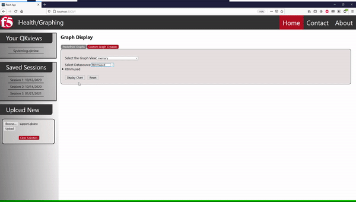

# F5 iHealth Capstone Project

Graph times series data that has been converted from RRD files.

- [Quick Overview](#quick-overview)
  * [Run graphing_utility](#run-graphing_utility)
  * [Run expressServer](#run-expressserver)
- [Input](#input)
- [Output](#output)
  * [Back end](#back-end)
    + [RRD Meta Data](#rrd-meta-data)
    + [DS Data](#ds-data)
  * [Front-end](#front-end)
- [Tests](#tests)

<small><i><a href='http://ecotrust-canada.github.io/markdown-toc/'>Table of contents generated with markdown-toc</a></i></small>


## Quick Overview


### Run graphing_utility
```js
$ npm install
```
```js
$ npm start
```
### Run expressServer
1. install prerequisites: 
```s
$ npm install
```
2. compile AppServer.ts:
```s
$ tsc AppServer.ts
```
3. execute AppServer:
```s
$ npm start
```
To test static server routes, try the following URL on the browser while the server is running:
* http://localhost:8080/
* http://localhost:8080/index.html
* http://localhost:8080/images/image1.png

To test dynamic server routes, try the following URL on the browser while the server is running:
* http://localhost:8080/one
* http://localhost:8080/add?var1=1&var2=2
* http://localhost:8080/name/israelh
* http://localhost:8080/name/hello

## Input


(Select and upload a .qkview file)

## Output

### Back end
The JSON file will be made up of two main parts:
1. The Meta data for the entire RRD file
2. All of the DS data
#### RRD Meta Data

```JSON
{
    "meta": {
        "interval": [ 
            {
                "start": 0,
                "end": 1600000000
            },
            { ... },
       ],
        "steps": [ ... ],
        "CF": [ ... ],
        "rows": [ ... ],
        "pdp_per_row": [ ... ],
        "xff": [ ... ],
        "legend": [ 
            "DS_NAME_0",
            "DS_NAME_1",
            ...,
            "DS_NAME_N-1",
            "DS_NAME_N"
        ]
    },
```
Each key within the Meta dictionary corresponds with an array of size equal to the RRA count.

#### DS Data
```JSON
    "DS_NAME_0": {
        "type": "GAUGE",
        "heartbeat": 30,
        "min": 0,
        "max": null,
        "data": {
            "10": [ 
                {
                  "x_value": 0,
                  "y_value": 0
                },
                {...},
                ],
            "30": [ ... ],
            "60": [ ... ],
            "600": [ ... ]
    },
    "DS_NAME_1": { ... },
    ...,
    "DS_NAME_N-1": { ... },
    "DS_NAME_N": { ... }
}
```


(files populating on the express server)

### Front-end


(View a predefined graph)




(View a custom graph)

## Tests
```js
$ npm run test
```
