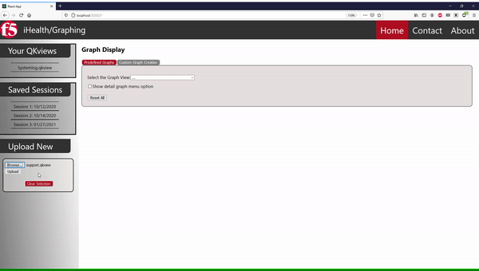
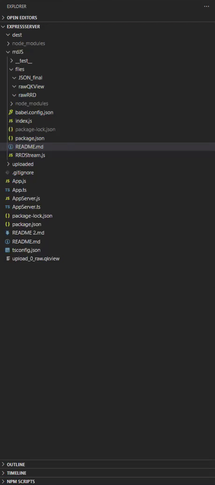
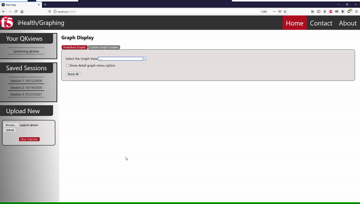
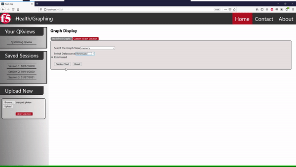

# F5 iHealth Capstone Project

Graph times series data that has been converted from RRD files.

## Quick Overview:


### Run graphing_utility:
```js
$ npm install
```
```js
$ npm start
```
### Run expressServer:

```js
$ npm install
```
```js
$ npm start
```

## Input:



(Select and upload a .qkview file)

## Output:

### Back end:
The JSON file will be made up of two main parts:
1. The Meta data for the entire RRD file
2. All of the DS data
#### RRD Meta Data:

```JSON
{
    "meta": {
        "interval": [ 
            {
                "start": 0,
                "end": 1600000000
            },
            { ... },
       ],
        "steps": [ ... ],
        "CF": [ ... ],
        "rows": [ ... ],
        "pdp_per_row": [ ... ],
        "xff": [ ... ],
        "legend": [ 
            "DS_NAME_0",
            "DS_NAME_1",
            ...,
            "DS_NAME_N-1",
            "DS_NAME_N"
        ]
    },
```
Each key within the Meta dictionary corresponds with an array of size equal to the RRA count.

### DS Data:
```JSON
    "DS_NAME_0": {
        "type": "GAUGE",
        "heartbeat": 30,
        "min": 0,
        "max": null,
        "data": {
            "10": [ 
                {
                  "x_value": 0,
                  "y_value": 0
                },
                {...},
                ],
            "30": [ ... ],
            "60": [ ... ],
            "600": [ ... ]
    },
    "DS_NAME_1": { ... },
    ...,
    "DS_NAME_N-1": { ... },
    "DS_NAME_N": { ... }
}
```



(files populating on the express server)

### Front-end


(View a predefined graph)



(View a custom graph)

## Tests:
```js
$ npm run test
```
